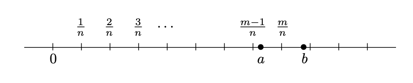

### Consequences of completeness

#### 4-1. Nested Interval Property

The statement looks similar to Example 1.2.2. My first thought was that it's going to be empty.. I guess the difference is that $I_n = [a_n,b_n]$ instead of $\{n,n+1,...\}$ (one, contingent on $a_n$ rather than $n$; two, has an upperbound of $b_n$).

Intuitively, the theorem follows from the fact that all $a_n$ is bounded by all $b_n$, thus by axiom of completeness, there's an $x$ nested for all intervals $[a_n,b_n]$.

Edit 2022-06-03: Now that I've done exercise 1.4.3, Nested Interval Property must be closed for the conclusion of the theorem to hold.

#### 4-2. Archimedean Property

Intuitively, property 1 saying that  $\mathbf{N}$ is not bounded above. It is interesting to note that the proof only depends on axiom of completeness and that $\mathbf{N}$ is closed under addition.

Not too sure what's the usefulness of property 2... it's just a reciprocal.. but it's saying that any positive real number is bigger than $1/n$ if $n$ is big enough.

#### 4-3. Density of Q in R

My god... Abbott is so good at explaining this proof. I have never seen any other authors explained the way he does.

I think the tricky part is just choosing m greater than na, such that m is small enough so that 

$$
m-1 \leq na <m
$$

How do we know such m exists? My first thought is that the key is actually to pick $n$ big enough so that it "step over" $(a,b)$. Such $n$ exists by property 2 of Archimedean property (ah, now i see why it's useful). As a result, $1/n$, scaled by some integer $m$, will straddle between $a$ and $a+1$ (see figure). Meaning $m/n$.. wait this does not follow (i iniatially thought of saying $m/n -1$ is less than $a$, but no, it is $m/n - 1/n$)

Ok i just looked at [MO](https://math.stackexchange.com/questions/103839/proof-that-mathbbq-is-dense-in-mathbbr). To prove existence of $m$, given any real $r$,

1. if $r>0$, then $\exists m$, where $m$ is natural number and $m>r$. Let $M$ be the set of such m's. By well-ordering, there is a $m_0 \leq m$. If $m_0=1$, then $0<r<1$ and we are done. If $m_0>1$ then $m_0-1 \leq r$ by well-ordering principle.
2. If $r=0$, then $m_0 =1$ and we are done.
3. If $r <0$, then let $w = -r$. By (1), there is $m_0-1 \leq w <m_0$, therefore $-m_0<r \leq 1-m_0$. If $r < 1-m_0$, we are done. Otherwise, choose $2 - m_0$ and we are done.

Edit 2022-06-03: Now that I have done exercise 1.4.6, the key part of this proof really is just in having $n$ so small such that $1/n < (a,b)$ for any $a$ and $b$.

#### 4-4. Density of irrational in R

Bro this is cool. I'm shook. Will go to blog post.

#### 4-5. Existence of square roots

I  suppose proof by construction has always been what Im weak at, and this theorem requires proof by constructions.

Essentially, the proof relies on finding a counterexample -- namely, a number whose square is bigger than $a^2$ but smaller than 2. To do that, need to use $(a + 1/n)^{2}$ and pick and $n$ that makes the terms less than 2.

On the other side is finding a number whose square is smaller than $a^2$ but bigger than 2. Again, key is to use $(a - 1/n)^{2}$ and to use $n$ that will make the term bigger than 2.

### Cardinality

#### 5-1. Correspondence

Cardinality is the size of a set.

#### 5-4. (-1,1) corresopondence with R

Very interesting. These two have the same cardinality by function $f(x) = x^2/(x^2-1)$. In fact, $(a,b)$ has same cardinaltiy with $\mathbf{R}$ for any $a,b$.

#### 5-6-1. The set Q is countable

Not quite sure how to make of this proof. I suppose the key step is that each $A_n$ is finite, and every rational number appears in exactly one of these sets. Reading this further, really the only things that help is that the formula is _onto_. That is, given any element of $\mathbf{Q}$, there is a natural number to be mapped with. And that the formula is 1-1: Since $A_n$ is disjoint, any $n_{1} \neq n_{2}, A_{n_{1}} \neq A_{n_{2}}$.

#### 5-6-2. The set R is countable

I don't quite follow why if list in (1) contains every real number, this leads to the conclusion that the infinite intersection of $I_n$ is empty.

From [mathstackexchange](https://math.stackexchange.com/questions/1481294/using-nested-intervals-to-prove-that-mathbbr-is-not-countable), given 

$\mathbf{R}_{s} = \{x_1,x_2,...\}$.

We have shown that for all $n0$, $x_{n0} \notin \cap I_{n}$. That is for all $x \in \mathbf{R}_{s}$, $x \notin \cap I_{n}$. Since we assume $\mathbf{R}_{s} = \mathbf{R}$, this implies $\cap I_{n} = \emptyset$.

Really like this sentence: If a set can be arranged into a single list, then deleting some elements from this list results in another (shorter, and potentially terminating) list. This means that countable sets are the smallest type of infinite set. Anything smaller is either still countable or finite.